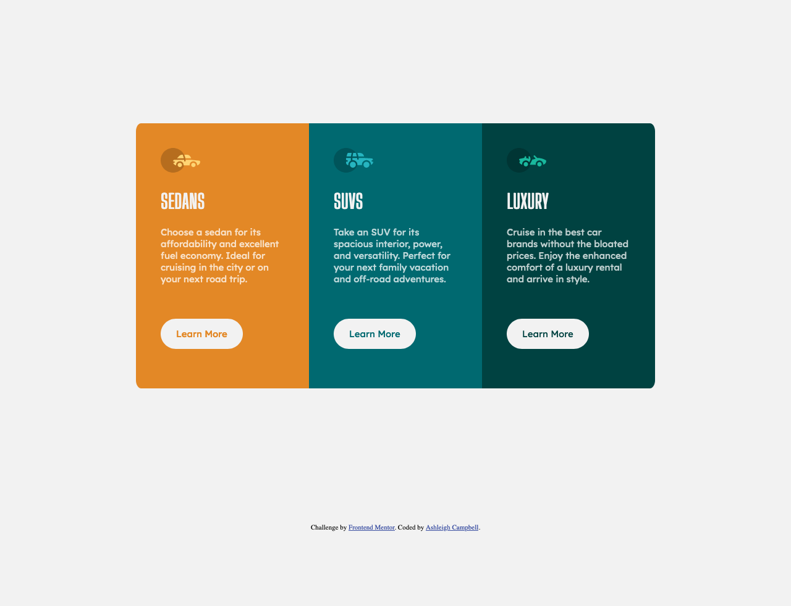

# Frontend Mentor - 3-column preview card component solution

This is a solution to the [3-column preview card component challenge on Frontend Mentor](https://www.frontendmentor.io/challenges/3column-preview-card-component-pH92eAR2-). Frontend Mentor challenges help you improve your coding skills by building realistic projects. 

## Table of contents

- [Overview](#overview)
  - [The challenge](#the-challenge)
  - [Screenshot](#screenshot)
  - [Links](#links)
- [My process](#my-process)
  - [Built with](#built-with)
  - [What I learned](#what-i-learned)
  - [Continued development](#continued-development)
  - [Useful resources](#useful-resources)
- [Author](#author)
- [Acknowledgments](#acknowledgments)

**Note: Delete this note and update the table of contents based on what sections you keep.**

## Overview

### The challenge

Users should be able to:

- View the optimal layout depending on their device's screen size
- See hover states for interactive elements

### Screenshot

### Links

- Solution URL: [GitHub Pages](https://ashleighlcampbell.github.io/frontend-mentor-3-column-preview-card-component/)

## My process

### Built with

- HTML5
- CSS

### What I learned

This was my first Frontend Mentor challenge, and I had a lot of fun completing it. I'm very excited about finding this site and building my frontend knowledge!

I have basic HTML and CSS knowledge and was able to complete the majority of the project without referring to resources. The areas that were the biggest challenge for me were: 
- Removing the whitespace between the card divs. I found [an article](https://css-tricks.com/fighting-the-space-between-inline-block-elements/) on css-tricks with various ways to tackle this, and I opted for the negative margin technique. 

- Changing the CSS for mobile view - specifically making sure the corners were rounded in the right places when the cards are stacked on top of each other. I used W3Schools for a mini primer on media queries for this. 

### Continued development

I'm curently working through Angela Yu's The Complete 2021 Web Development Bootcamp on [Udemy](https://www.udemy.com/course/the-complete-web-development-bootcamp/learn/lecture/13306918#overview). I will need to supplement this because it does not cover Flexbox or Grid, which I expect I will need for future challenges. 

I'm also planning to work through FreeCodeCamp's [Response Web Design](https://www.freecodecamp.org/learn/responsive-web-design/) tutorials. 

**Note: Delete this note and the content within this section and replace with your own plans for continued development.**

### Useful resources

- [CSS Tricks](https://css-tricks.com/fighting-the-space-between-inline-block-elements/) - I used this guide to figure out the spacing between inline block elements.
- [W3 Schools](https://www.w3schools.com/css/css_rwd_mediaqueries.asp) - I used this to determine how to change the layout on mobile devices. 
- [Visual Studio Code](https://code.visualstudio.com/docs/languages/markdown) - How to preview markdown files locally in Visual Studio Code.
- [Free Code Camp](https://www.freecodecamp.org/learn/responsive-web-design/)
- [Udemy - The Complete 2021 Web Development Bootcamp](https://www.udemy.com/course/the-complete-web-development-bootcamp/learn/lecture/13306918#overview)

## Author
- Frontend Mentor - [@ashleighlcampbell](https://www.frontendmentor.io/profile/ashleighlcampbell)

